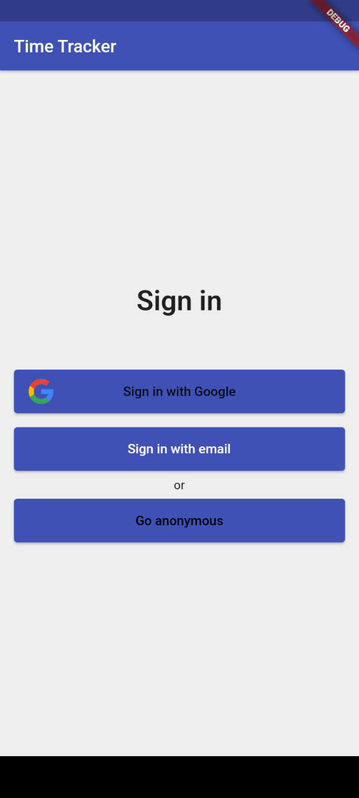
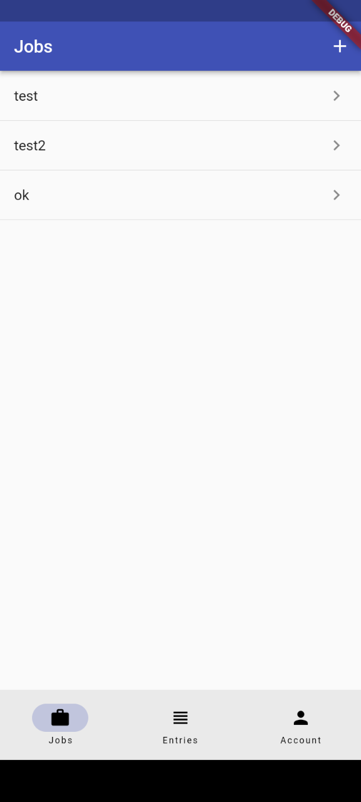
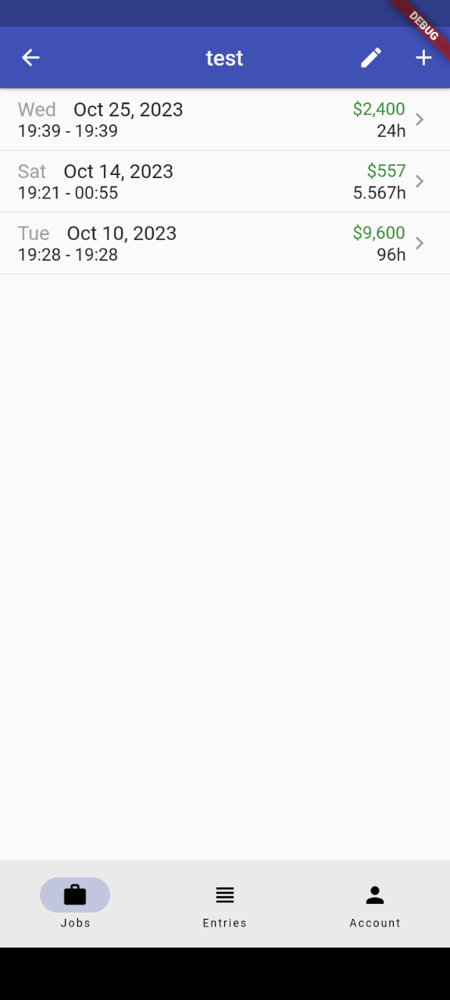
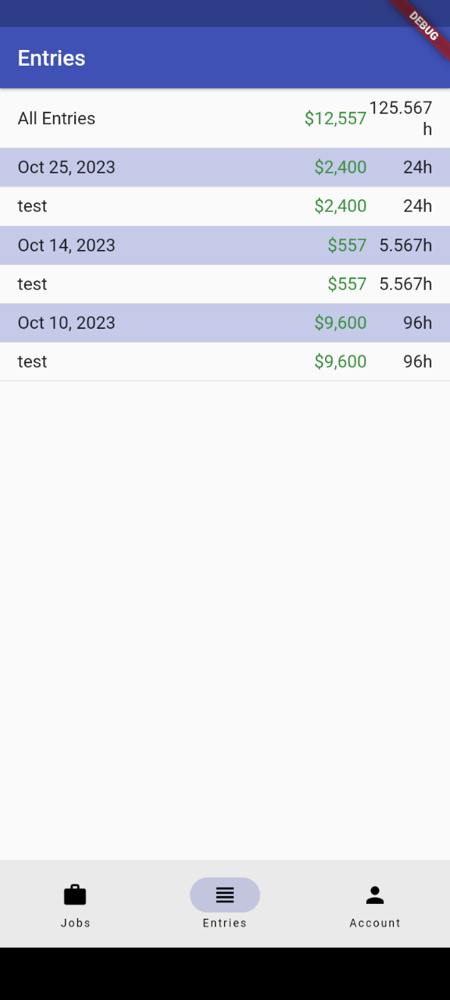
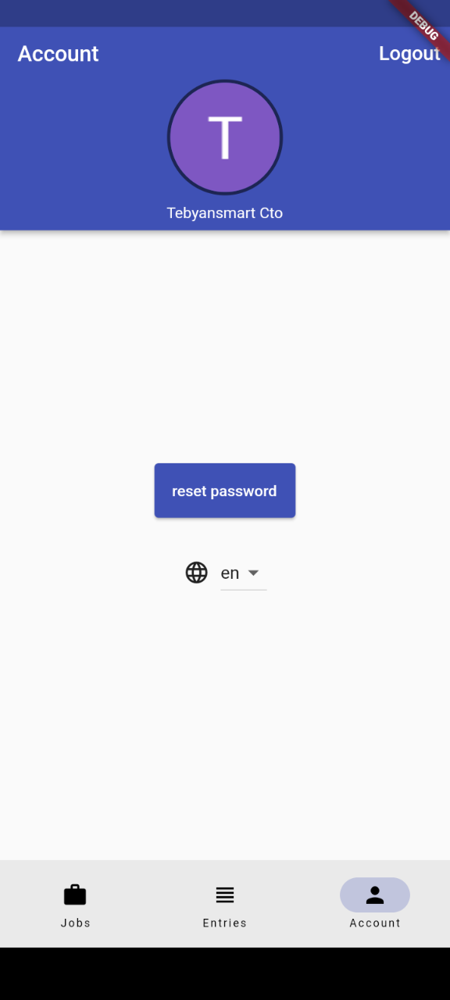

# time_tracker_app

an application to track your jobs.
check live demo on:
[https://time-tracker-app-64906.web.app
](https://time-tracker-app-64906.web.app)

    

- you can change your language in app; supported locales are english and farsi
- login in application is with firebase auth, you can sign in with google, email and password or you can easily jost go anonymous
- navigation is based on go_router package
- application logic is with BLoC pattern 

